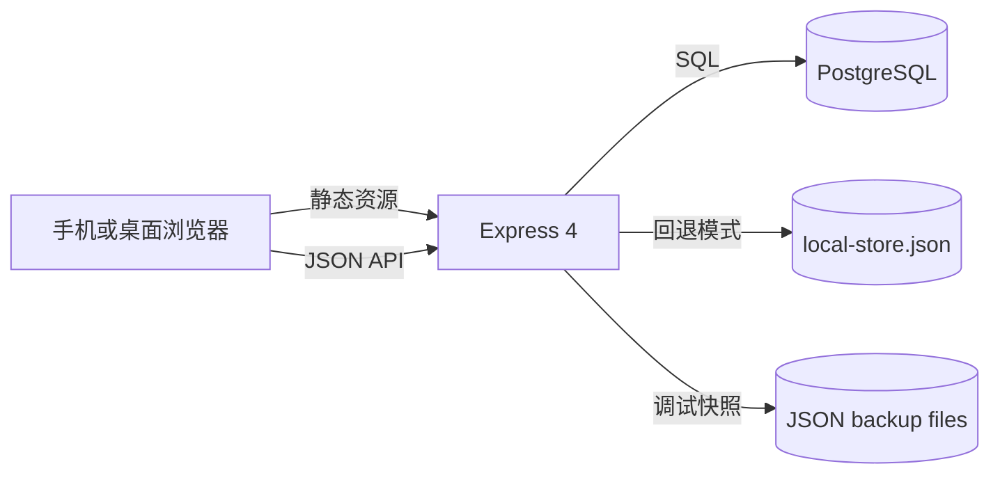

# Time River 技术架构

## 1. 架构目标

Time River 是一个单进程、低依赖的 Node.js Web 应用。目标是在 Render 上快速部署，同时为手机和桌面浏览器提供双日程编辑、历史快照和基于链接的独立疆域协作。

项目没有前端构建步骤，也不依赖框架。服务器直接提供静态 HTML、CSS、JavaScript 和 JSON API。持久化层优先使用 PostgreSQL，未配置数据库时可以回退到本地 JSON 文件。

## 2. 运行拓扑



一次部署只运行一个 `server.js` 进程。Express 同时负责静态文件、API、健康检查和疆域路由。浏览器保存完整的当前计划内存状态，每次保存都把规范化后的完整计划发送给服务器。

## 3. 目录与职责

```text
Time-River/
├─ server.js                    Express、API、存储适配和备份
├─ render.yaml                  Render 构建、启动、健康检查和环境变量声明
├─ package.json                 Node 版本、依赖和执行脚本
├─ scripts/check.js             语法、部署和文档契约检查
├─ tests/                       Node 内置测试
├─ public/
│  ├─ index.html                当前计划页面和弹窗结构
│  ├─ main.js                   当前计划状态、渲染、保存和交互
│  ├─ history.html              历史列表与只读详情结构
│  ├─ history.js                历史读取、选择、只读渲染和打印
│  ├─ shared.js                 时间、合并、摘要、疆域等共享规则
│  ├─ guide.html                应用内产品说明
│  └─ styles.css                视觉系统、响应式和打印样式
└─ docs/
   ├─ PRODUCT_MANUAL.md         产品说明书
   ├─ TECHNICAL_ARCHITECTURE.md 本文档
   ├─ CORE_LOGIC.md             核心逻辑说明
   ├─ audits/                   手机端审查证据
   └─ superpowers/              设计规格与实施计划
```

当前代码规模较小，保留单文件服务器和单文件页面控制器可以减少构建与部署复杂度。共享业务规则已经集中在 `public/shared.js`，避免计划页和历史页对时间统计产生不同结果。

## 4. 运行时与依赖

- Node.js：`24.x`。
- Web 框架：Express `4.x`。
- PostgreSQL 客户端：`pg`。
- 前端：原生 HTML、CSS、DOM API 和 Fetch API。
- 测试：Node 内置 `node:test`、`assert` 和 `vm`。

项目已移除 `better-sqlite3`，因此 Render 构建不再需要编译原生 SQLite 扩展。`npm ci` 只安装纯 JavaScript 依赖和 `pg`。

## 5. 服务器启动流程

`npm start` 执行：

```text
node --disable-warning=ExperimentalWarning server.js
```

启动顺序如下：

1. 读取 `PORT`、`DATABASE_URL`、`LOCAL_DATA_PATH` 和 `BACKUP_DIR`。
2. 创建本地数据与备份目录。
3. 根据数据库连接值选择 `postgres` 或 `file` 存储驱动。
4. 注册 JSON 请求体、静态资源、API、健康检查和疆域路由。
5. 开始监听端口，同时异步初始化存储。
6. PostgreSQL 模式下创建缺失表、字段和索引；文件模式下创建初始 JSON 文件。
7. 写入一份最新调试快照，并将存储标记为可用。

存储初始化失败不会让 Node 进程立即退出，但 API 请求会在 `ensureStorageReady()` 中重试并通过统一错误处理中间件返回 500。`/health` 会报告 `starting`、`ok` 或 `degraded`。

## 6. 静态前端架构

### 6.1 当前计划页面

`index.html` 提供固定 DOM 骨架，`main.js` 在启动后请求 `/api/schedule`，通过 `mergeScheduleData()` 生成完整规范状态，再渲染两个日期列。

每个时间格同时包含：

- 桌面 textarea。
- 手机编辑 button。
- 有内容时的完成 button。
- 可合并时的原生 select。

两种编辑表面始终同时存在，由 CSS 的 720px 断点决定显示哪一种。这避免了首次渲染宽度与后续旋转、缩放或窗口调整不一致时内容消失。

### 6.2 历史页面

`history.js` 先获取轻量列表 `/api/archives`，再按需请求 `/api/archives/:id`。详情缓存在页面内 `Map` 中，重复选择同一记录不会再次请求服务器。

历史时间列使用与当前计划相同的共享格式化和合并规则，但只创建普通只读元素，不生成输入控件。

### 6.3 产品说明页面

`guide.html` 为纯静态页面，不加载 `shared.js` 或业务脚本，不访问 API。即使存储初始化失败，Express 静态服务仍可返回说明内容。

## 7. 前端状态模型

规范化后的计划结构：

```json
{
  "d1name": "第一天名称",
  "d2name": "第二天名称",
  "d1date": "日期文本",
  "d2date": "日期文本",
  "slots": {
    "6": {
      "d1": "晨间计划",
      "d2": "",
      "d1checked": true,
      "d2checked": false
    }
  },
  "merges": {
    "d1": { "6": 3 },
    "d2": {}
  }
}
```

`slots` 在浏览器中总是包含 24 个小时键。`merges` 只记录大于 1 的有效跨度。缺失值、错误类型或旧版本数据会在 `mergeScheduleData()` 中归一化。

## 8. API 设计

所有接口与页面同源，不配置额外 CORS。

| 方法 | 路径 | 作用 |
| --- | --- | --- |
| GET | `/api/schedule` | 读取当前计划与更新时间 |
| POST | `/api/schedule` | 保存完整当前计划 |
| GET | `/api/archives` | 获取封存记录摘要列表 |
| GET | `/api/archives/:id` | 获取单条封存快照 |
| POST | `/api/archives` | 创建不可编辑封存快照 |
| GET | `/api/export` | 导出当前计划和全部历史 JSON |
| GET | `/health` | 返回进程与存储状态 |

疆域通过 `?realm=<slug>` 传入 API。POST 请求也在 JSON 中携带 `realm`，服务器优先读取查询参数。主页面使用内部标识 `main`；疆域计划使用 `realm:<slug>` 作为 schedule 主键，历史表使用 `realm_id` 过滤。

## 9. PostgreSQL 存储

### 9.1 schedules

```sql
CREATE TABLE schedules (
  id TEXT PRIMARY KEY,
  data JSONB NOT NULL,
  updated_at BIGINT NOT NULL
);
```

每个主页面或疆域占一行。保存使用 `INSERT ... ON CONFLICT DO UPDATE`，属于完整文档覆盖写入，客户端之间采用最后一次到达服务器的保存结果。

### 9.2 archives

```sql
CREATE TABLE archives (
  id TEXT PRIMARY KEY,
  title TEXT NOT NULL,
  data JSONB NOT NULL,
  d1_name TEXT NOT NULL,
  d2_name TEXT NOT NULL,
  entry_count INTEGER NOT NULL,
  created_at BIGINT NOT NULL,
  realm_id TEXT NOT NULL DEFAULT 'main'
);
```

`archives` 只执行插入和读取。列表查询通过 `(realm_id, created_at DESC)` 索引按疆域和时间倒序返回。

## 10. 文件存储回退

没有有效数据库连接时，服务器使用 `LOCAL_DATA_PATH` 指向的 JSON 文件。结构包括主计划、历史数组和各疆域计划。写入使用临时文件加重命名，降低进程中途退出造成半截 JSON 的风险。

文件模式适合本地开发和临时演示。Render 未挂载持久磁盘时，本地文件可能在重启、迁移或重新部署后丢失，不应作为生产长期持久化方案。

## 11. 备份与导出

服务器在初始化、保存计划和创建封存后生成 `time-river-latest.json`。每次封存还会产生带时间与事件名的独立 JSON 文件。

这些文件位于 `BACKUP_DIR`，用于人工检查和临时恢复。Render 普通实例的文件系统是临时的，因此它们不是数据库之外的可靠异地备份。

`GET /api/export` 动态读取存储并返回完整 JSON，可用于下载人工备份。导出内容包含存储驱动信息、当前计划和历史记录。

## 12. Render 部署

`render.yaml` 定义：

- Runtime：Node。
- Build：`npm ci`。
- Start：`npm start`。
- Health check：`/health`。
- Node engine：由 `package.json` 固定为 `24.x`。
- `DATABASE_URL`：Render 环境变量入口。
- `BACKUP_DIR`：Render 项目目录下的调试备份路径。
- `NODE_ENV=production`。

部署前检查：

1. `npm ci` 成功且不出现原生 SQLite 编译。
2. `npm test` 全部通过。
3. `npm run check` 全部通过。
4. Render 使用与现有数据相同的数据库连接。
5. `/health` 返回目标驱动且 `storage_ready=true`。
6. 浏览器显示旧数据并能够完成一次测试同步。

## 13. 路由设计

- `/`：主计划。
- `/history.html`：主计划历史。
- `/guide.html`：产品说明。
- `/<slug>`：独立疆域计划。
- `/<slug>/history`：独立疆域历史。

疆域 slug 允许中文、小写英文字母、数字和单个连字符分段，最长 64 字符。客户端会把英文大写转为小写、空格转为连字符，并清理其他字符。服务器再次校验，避免非法路径进入存储标识。

## 14. 响应式架构

主要断点：

- `980px`：双列计划和历史布局切换为单列。
- `720px`：启用手机日期切换、手机编辑面板、单日显示和底部双列操作区。

手机端的唯一粘性控件是日期切换器。当前计划的功能区通过 flex 顺序放在主内容之后，并使用双列网格完整展示。历史页返回/打印栏在手机端为普通静态内容，避免与粘性日期切换器重叠。

## 15. 打印架构

打印由浏览器原生 `window.print()` 触发。`@media print` 隐藏顶栏、加载层、弹窗、提示、同步文字和时长控件。日程与历史详情仍使用普通文档流，因此无需生成单独 PDF 或服务端模板。

## 16. 错误处理

- API 路由使用 `asyncHandler()` 把 Promise 错误交给统一中间件。
- 服务器错误只向客户端返回通用 `Internal server error`，详细错误记录到服务日志。
- 客户端读取失败显示“无法连接”，仍渲染空的本地结构。
- 保存失败显示“同步失败”，保留当前内存状态。
- 封存失败保持弹窗打开，并显示服务端错误文本。
- 历史读取失败显示“暂时无法读取封存内容”。

## 17. 并发与一致性

计划采用完整文档、最后写入覆盖模型，没有字段级合并或版本冲突检测。单人或低频协作下结构简单稳定；多人同时编辑同一疆域时，较晚到达服务器的完整 payload 可能覆盖另一人的近期修改。

封存记录在创建后不更新，因此历史快照不存在并发编辑问题。列表与详情按 `realm_id` 隔离。

## 18. 安全边界

当前项目没有用户账号、鉴权、权限分级或 CSRF 令牌。主页面和知道疆域链接的人都可以读取和修改对应计划。它适用于低敏感、小范围共享场景，不适合保存机密、财务、医疗或需要审计的数据。

用户输入在页面中使用 `textContent` 或表单 value 呈现。历史列表不使用标题 HTML 插值，避免把事件名称解释为页面标记。

## 19. 测试与质量门禁

```bash
npm test
npm run check
git diff --check
```

`npm test` 验证时间范围、摘要基础规则、疆域 slug、移动端源代码契约和文档完整性。`npm run check` 编译检查主要 JavaScript 文件，并验证数据库配置入口、Render 配置、产品说明链接和文档文件。

最终发布还需要真实浏览器验证 320px、390px、430px 和横屏，覆盖编辑、合并、完成、切日、摘要、封存、历史、说明页和打印样式。自动测试不能替代视觉和触控流程检查。

## 20. 可演进方向

如果项目规模扩大，可按风险优先级演进：

1. 为计划保存增加修订号和冲突提示。
2. 增加受控身份与疆域访问令牌。
3. 把服务器存储逻辑拆成独立模块并增加 API 集成测试。
4. 将备份写入对象存储而不是临时磁盘。
5. 增加历史恢复为当前计划的显式操作。
6. 在不改变数据结构的前提下引入离线队列。

这些能力不属于当前轻量版本，现有实现优先保持易部署、易理解和低维护成本。
